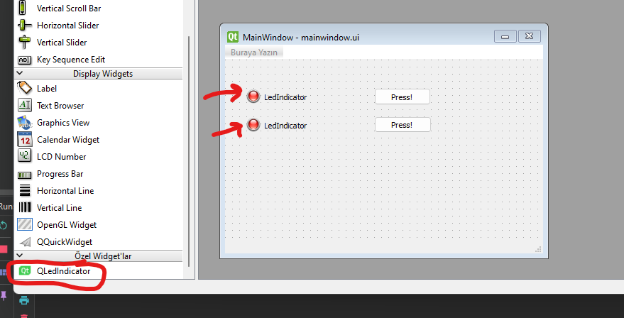
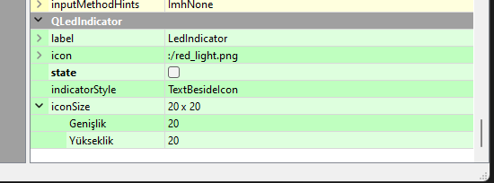

# Custom Widgets Plugin Example for Qt Designer with CMake

To briefly summarize what this repo does, it is useful for QtDesigner.
I made a plugin design. Actually this is pretty simple. However, all official guides are prepared for qmake. I love using CMake.
I changed and adapted the project via CMake with small touches (such as pulling property information from the .xml page, not the code). I distribute it as a shared library in a sample application
I showed you how to use it. I hope it will be useful work.

If I have time, I will try to explain in detail.

## Screenshot:

## How to use?

- First you need to compile the Plugin. A "*.dll" file and a "*.a" file will be created.
  I directed them to the "export" folder for quick and easy access. Experienced users can directly remove it wherever they want.
- Copy the resulting "*.dll" file to the directory where QtDesigner is running. (For me it was the "C:\DevTools\Qt\5.15.2\mingw81_64\plugins\designer" directory.)
- Then run QtDesigner. In the "Custom Widgets" tab, you will see a widget named "QLedIndicator".
  You can drag and use it as you wish.

## Includes:
### QLedIndicator:

- label: The text to be displayed on the widget.
- icon: The icon to be displayed on the widget.
- state: The state of the widget. (On / Off)
- indicatorStyle: The style of the widget.
- iconSize: The size of the icon to be displayed on the widget.

## How can you write your own plugin?

coming soon...

## Development Environment:
- Qt 5.15.2
- CMake 3.20.2
- MinGW 8.1.0
- Windows 11

## Contact
Hakan Kaya
- [Mail](mailto:mail@hakankaya.kim)
- [Linkedin](https://www.linkedin.com/in/haknkayaa/)

